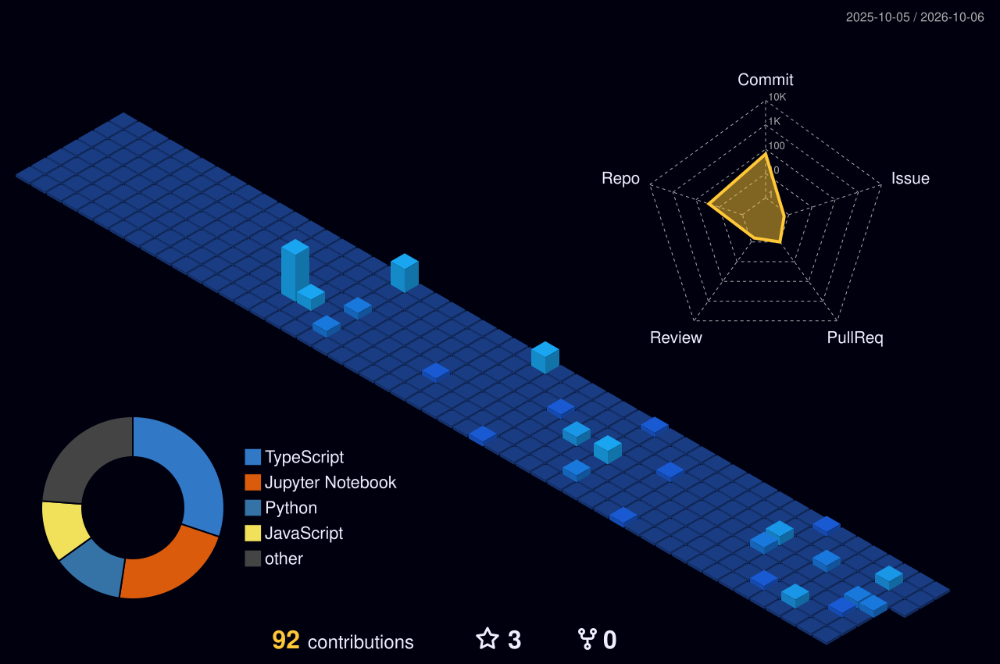

  

  

  

  

## 🚀 Featured Builds

| Project | What it is | Stack |
|:---|:---|:---|
| [**Datalytics AI**](https://github.com/sangamsingh18/Datalytics-AI-An-End-to-End-Intelligent-Data-Analytics-and-Machine-Learning-Platform) | AI-powered analytics and AutoML platform with EDA, visualization, model training, prediction and AI-generated reports. | `React` `FastAPI` `Python` `Pandas` `Scikit-learn` `Plotly` |
| [**ApnaCoach**](https://github.com/sangamsingh18/ApnaCoach-AI-Powered-Interview-Practice-Placement-Preparation-Platform) | AI mock-interview and career-readiness platform with ATS scoring, assessments, reports and personalized study plans. | `React` `Node.js` `Groq AI` `Firebase` `Razorpay` |
| [**InsightRAG**](https://github.com/sangamsingh18/-InsightRAG--Chat-with-GitHub-Repositories-PDFs-and-YouTube-Content) | Multi-source RAG assistant for GitHub repositories, YouTube transcripts and PDF documents. | `Python` `LangChain` `ChromaDB` `Supabase` `Streamlit` |
| **Healthcare Smart OPD** | AI-assisted healthcare management concept covering appointments, patient records, medical reports and intelligent assistance. | `React` `Node.js` `Express` `MongoDB` `ML` `GenAI` |
| **SyncTYPE** | Chrome extension that auto-fills college, job and registration forms through rule-based field matching. | `JavaScript` `Manifest V3` `HTML` `CSS` |

 

## 🌃 My Contribution City

*Every commit builds another tower — regenerated automatically by GitHub Actions.*

  

## 🐍 Contribution Snake

  

  

 

**Always learning. Always building.** 💜

