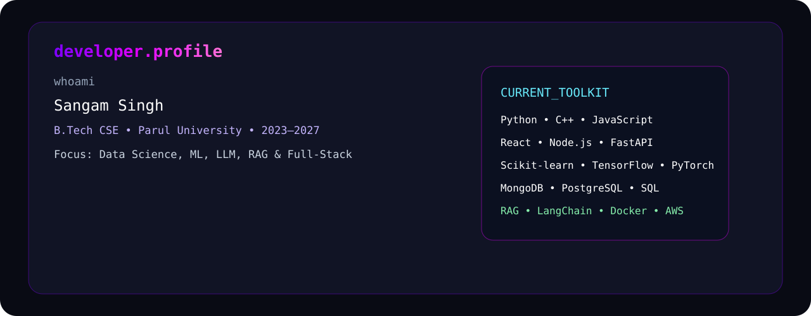
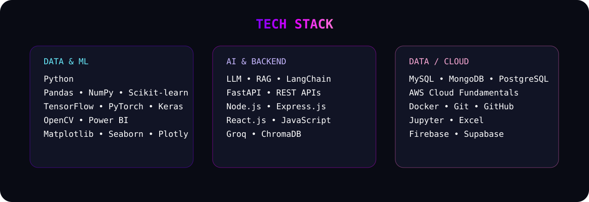
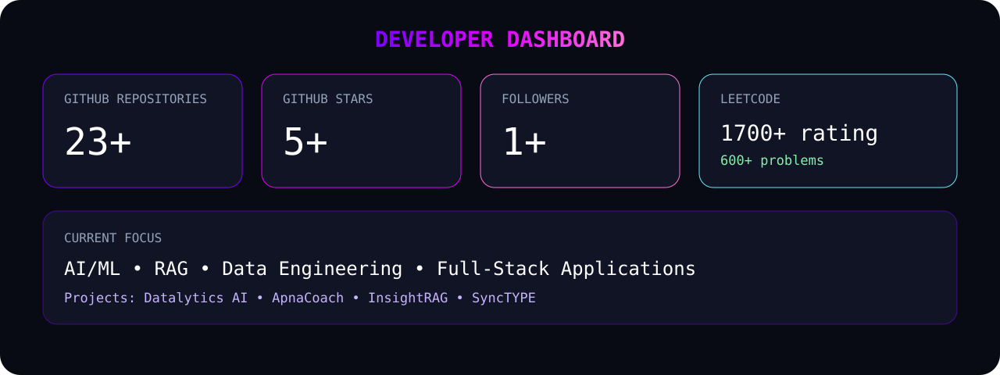
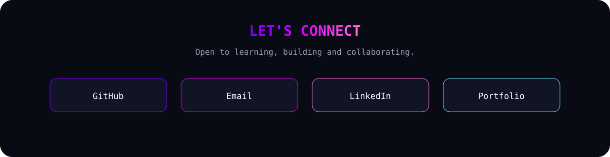

  

  

  

## 🛠️ Tech Stack

  

## 🪪 Developer Dashboard

---

## 👋 About Me

- 🎓 B.Tech Computer Science & Engineering student at **Parul University**, expected 2027.
- 💻 Focused on **Data Science, Machine Learning, LLMs, RAG and Full-Stack Development**.
- 🧠 Comfortable with **Python, C++, JavaScript, SQL, React, Node.js, FastAPI and Scikit-learn**.
- 🚀 Building practical AI products including **Datalytics AI, ApnaCoach and InsightRAG**.
- 📈 Solved **600+ DSA problems** and reached a **1700+ peak LeetCode contest rating**.
- 📍 Vadodara, Gujarat, India.

> The profile content above is based on the supplied resume materials. The current GitHub account statistics are rendered dynamically below.

---

## 🚀 Featured Projects

| Project | Description | Main Stack |
|:---|:---|:---|
| **[Datalytics AI](https://github.com/sangamsingh18/Datalytics-AI-An-End-to-End-Intelligent-Data-Analytics-and-Machine-Learning-Platform)** | Intelligent analytics and AutoML platform with large-dataset ingestion, model automation and AI-generated insights. | `Python` `FastAPI` `React` `Scikit-learn` `Groq` `MongoDB` `Docker` |
| **[ApnaCoach](https://github.com/sangamsingh18/ApnaCoach-AI-Powered-Interview-Practice-Placement-Preparation-Platform)** | AI career platform with conversational mock interviews, ATS resume scoring, assessments and personalized reports. | `React` `Node.js` `Groq AI` `Firebase` `Razorpay` |
| **[InsightRAG](https://github.com/sangamsingh18/-InsightRAG--Chat-with-GitHub-Repositories-PDFs-and-YouTube-Content)** | Multi-source RAG assistant for GitHub repositories, YouTube transcripts and PDF documents. | `Python` `LangChain` `ChromaDB` `Supabase` `Streamlit` |
| **SyncTYPE** | Chrome extension for automatically filling college, job and registration forms using a rule-based field matching engine. | `JavaScript` `Manifest V3` `HTML` `CSS` |

---

## 💼 Experience

### Admission Assistant & Marketing Intern — Parul University
**Mar 2025 – Nov 2025 · Vadodara, Gujarat**

- Processed and tracked **100+ student applications**.
- Built enrollment dashboards in **Microsoft Excel and Google Sheets**.
- Supported digital outreach, follow-ups and enrollment campaigns.
- Resume-reported improvements include **40% faster response time**, **30% reporting-efficiency improvement**, and **25% higher qualified inquiry volume**.

---

## 🏆 Certifications

- **Deloitte Australia Data Analytics Virtual Experience — Forage (2024)**
- **AWS Academy Cloud Foundations — Amazon Web Services (2024)**
- **SQL Intermediate Certificate — HackerRank (2024)**
- **Computer Networks and Internet Protocol — NPTEL (2024)**
- **Salesforce Administrator (ADM-201) — 2026** *(included in the supplied MERN resume)*

---

## 📊 GitHub Statistics

  

  

---

## 🏅 LeetCode

  

**Peak Contest Rating: 1700+ · Problems Solved: 600+**

---

  

  

**Always learning. Always building. 🚀**

